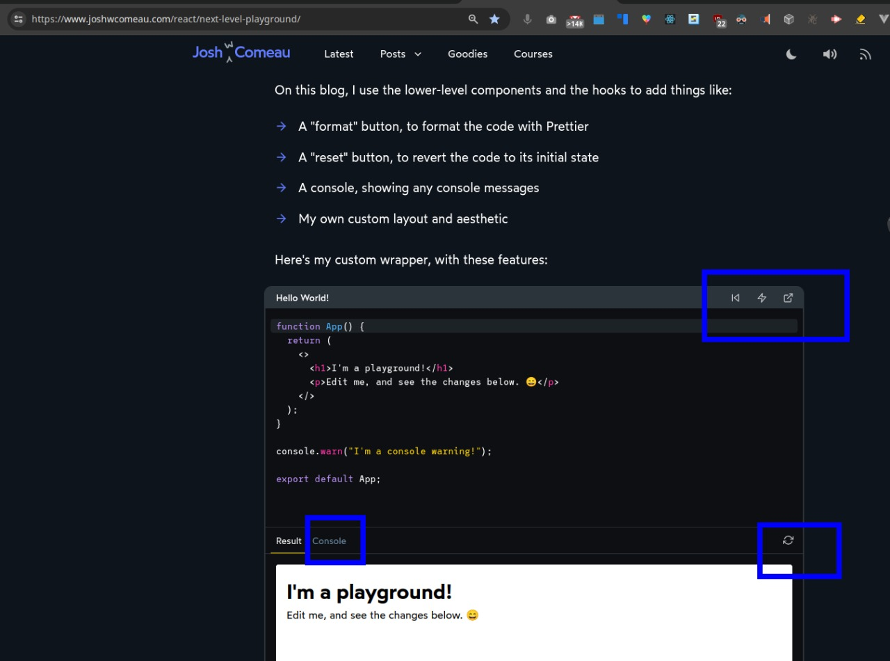
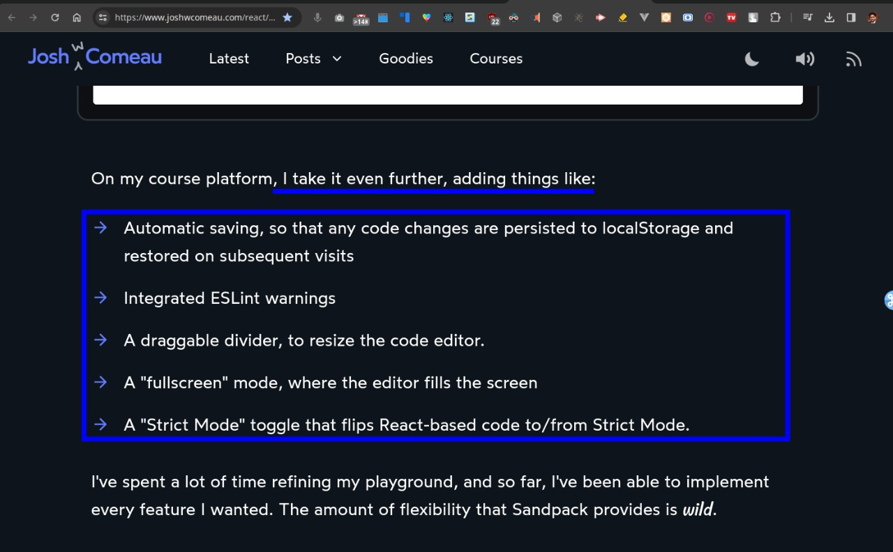

# Learn `sandpack-react` 

**View Live: [Click here](https://learn-sandpack.vercel.app/)**

- Awesome Docs: Usage of sandpack: [Click here](https://sandpack.codesandbox.io/docs/getting-started/usage#dependencies)
- Source - A World-Class Code Playground with Sandpack by Josh W. Comeau [Click here](https://www.joshwcomeau.com/react/next-level-playground/)
- Docs - Sandpack React: [Click here](https://sandpack.codesandbox.io/docs)
	- Sandpack React Templates: [Click here](https://github.com/codesandbox/sandpack/tree/main/sandpack-react/src/templates)
	- Sandpack Migration Guide: [Click here](https://sandpack.codesandbox.io/docs/resources/migration-guide/v2)

SandpackProvider is our main component, the one that takes a set of files and bundles them into an application. It then provides the necessary data to all child components via React context. 

There are lots of additional LEGO™ bricks for us to mix and match, including things like SandpackFileExplorer, SandpackConsole, and SandpackTests.

For full customization, however, we need to access the underlying state. And that's where their custom hooks come in.

`Open in Codesandbox` Feature
- Quoting from Josh: Initially, I didn't think much of this feature, but I've come to realize that it's amazing. It makes it super easy for folks to share chunks of code. If someone gets stuck on something and need help, they can click this button and send me the URL, instead of having to describe what they did, or copy/paste all of the code (which is often split across multiple files).

## List of all templates available in sandpack

Docs: [Click here](https://sandpack.codesandbox.io/docs/getting-started/usage#dependencies)

## Predefined Themes

- Docs: [Click here](https://sandpack.codesandbox.io/docs/advanced-usage#sandpackpredefinedtheme)
- Sandpack Theme Builder - [Click here](https://sandpack.codesandbox.io/theme)
- Sarah Drasner's wonderful `Night Owl`: [Click here](https://github.com/sdras/night-owl-vscode-theme)

## Editor?

- CodeMirror: [Click here](https://codemirror.net/)
- Monaco: [Click here](https://microsoft.github.io/monaco-editor/)

Default editor in `sandpack-react` used is `CodeMirror` but you can switch to `Monaco` by following this section in docs: [Click here](https://sandpack.codesandbox.io/docs/guides/integrate-monaco-editor)

## Other Custom Features ?

 
 
